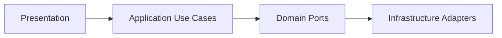

# PDV Touch Restaurante

Base arquitetural de um sistema de PDV para restaurantes usando React + TypeScript, com foco em escalabilidade, testabilidade e baixo acoplamento.

## Arquitetura Adotada

O projeto segue uma abordagem de Arquitetura Hexagonal/Clean no frontend, organizada por módulos de domínio.

Camadas por módulo:
- `domain`: entidades, regras de negócio e contratos (ports).
- `application`: casos de uso e DTOs de entrada.
- `infrastructure`: implementações de repositórios/adapters.
- `presentation`: páginas, hooks e componentes React.

Autorização:
- RBAC centralizado por permissão via policy service no domínio de auth.

Sincronização offline/online:
- Estratégia de conflito por `version` e, em caso de empate, pelo `updatedAt` mais recente.
- Metadados de sincronização em entidades (`version`, `lastSyncedAt`).
- Retry com backoff exponencial para operações de pull/push.
- Fila de reenvio para tarefas de sincronização com reagendamento automático, persistida em Dexie quando disponível.
- Processamento multimódulo da fila para `SYNC_PRODUCTS` e `SYNC_ORDERS`.

Sensor de peso em tempo real:
- Backend publica `atualizar_peso` via Socket.IO somente com comanda ativa.
- O frontend recebe o peso estável e permite aplicá-lo ao item por peso.

Fluxo principal:



## Stack Tecnológica

- React 18
- TypeScript 5
- Vite 5
- Vitest 2
- Dexie (IndexedDB)

## Estrutura do Projeto

```text
src/
  app/
    App.tsx
    styles.css
  modules/
    auth/
      domain/
      presentation/
    orders/
      domain/
      application/
      infrastructure/
      presentation/
    products/
      domain/
      application/
      infrastructure/
      presentation/
    stock/
      domain/
      application/
tests/
  unit/
  integration/
  e2e/
```

## Casos de Uso Implementados

Módulo `orders`:
- `CreateOrder`
- `AddItemToOrder`
- `AdvanceOrderStatus`

Módulo `products`:
- `CreateProduct`

Módulo `stock`:
- `AdjustStock`

Regra de negócio coberta:
- item por peso (`byWeight = true`) exige `weight`.
- total do pedido calculado no domínio, independentemente de React/UI.

## Testes Implementados

- Unitários:
  - cálculo de item unitário por quantidade
  - cálculo de item por peso
  - validação de peso obrigatório
  - total de pedido com itens mistos

- Integração (application + repository):
  - cria pedido e adiciona item por peso
  - falha ao adicionar item em pedido inexistente
  - cria produto e ajusta o estoque
  - falha ao ajustar estoque de produto inexistente

- E2E (fluxo de tela):
  - abre a comanda, cria o pedido, aplica o peso do sensor e avança o status

- Sincronização:
  - sincroniza pedidos com merge local/remoto e resolução de conflito por versão/timestamp
  - sincroniza produtos com retry/backoff e fila de reenvio

## Como Executar

Pré-requisitos:
- Node.js 18+
- npm 8+

Instalação:

```bash
npm install
```

Desenvolvimento:

```bash
npm run dev
```

Testes:

```bash
npm run test
```

Build de produção:

```bash
npm run build
```

## PostgreSQL Local (Backend)

O backend de comandas agora tenta usar PostgreSQL local por padrão e cria as tabelas automaticamente na inicialização.

Tabelas criadas:
- `pdv_comanda_state`
- `pdv_comanda_audit`

Variáveis de ambiente suportadas:
- `PDV_USE_POSTGRES`: `true|false` (padrão: `true`)
- `DATABASE_URL`: string de conexão completa (opcional)
- `PGHOST` (padrão: `127.0.0.1`)
- `PGPORT` (padrão: `5432`)
- `PGDATABASE` (padrão: `postgres`)
- `PGUSER` (padrão: `postgres`)
- `PGPASSWORD` (sem padrão)
- `PGSSL`: `true|false` (padrão: `false`)

Exemplo PowerShell (Windows):

```powershell
$env:PGHOST="127.0.0.1"
$env:PGPORT="5432"
$env:PGDATABASE="postgres"
$env:PGUSER="postgres"
$env:PGPASSWORD="sua_senha"
$env:PDV_USE_POSTGRES="true"
```

Iniciar o backend (criação automática das tabelas na inicialização):

```bash
npm run backend:start
```

Modo desenvolvimento com reload:

```bash
npm run backend:dev
```

Se a conexão com o PostgreSQL falhar, o backend faz fallback automático para persistência em arquivo local.

## Trade-offs da Solução

Prós:
- Alta testabilidade da lógica de negócio.
- Menor acoplamento entre UI e persistência.
- Facilidade para trocar adapter (ex.: InMemory -> Dexie/API).

Contras:
- Mais estrutura inicial e mais arquivos.
- Curva de aprendizado para equipe sem familiaridade com Clean/Hexagonal.

## Skill Consolidada do Projeto

Foi criada uma skill consolidada com todo o estado atual do sistema, incluindo arquitetura, fluxos operacionais de comanda, autenticação por PIN, confirmação de ações sensíveis, atalhos de teclado e checklist de validação:

- `.github/skills/pdv-touch-enterprise/SKILL.md`

## Próximos Passos Sugeridos

1. Adicionar observabilidade de erros e telemetria de uso.
2. Introduzir auditoria de alterações em pedidos e estoque.
3. Cobrir no E2E o caminho por peso e as transições até `ENTREGUE`.
4. Persistir a fila de sincronização (atualmente em memória) para garantir resiliência entre reinicializações.
