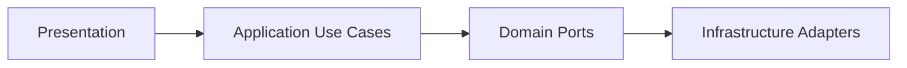

# PDV Touch Restaurante

Base arquitetural de um sistema de PDV para restaurantes usando React + TypeScript, com foco em escalabilidade, testabilidade e baixo acoplamento.

## Arquitetura Adotada

O projeto segue uma abordagem de Arquitetura Hexagonal/Clean no frontend, organizada por modulos de dominio.

Camadas por modulo:
- `domain`: entidades, regras de negocio e contratos (ports).
- `application`: casos de uso e DTOs de entrada.
- `infrastructure`: implementacoes de repositos/adapters.
- `presentation`: paginas, hooks e componentes React.

Autorizacao:
- RBAC centralizado por permissao via policy service no dominio de auth.

Sincronizacao offline/online:
- Estrategia de conflito por `version` e, em empate, `updatedAt` mais recente.
- Metadados de sincronizacao em entidades (`version`, `lastSyncedAt`).
- Retry com backoff exponencial para operacoes de pull/push.
- Fila de reenvio para tarefas de sincronizacao com reagendamento automatico, persistida em Dexie quando disponivel.
- Processamento multi-modulo da fila para `SYNC_PRODUCTS` e `SYNC_ORDERS`.

Sensor de peso em tempo real:
- Backend publica `atualizar_peso` via Socket.IO somente com comanda ativa.
- Frontend recebe peso estavel e permite aplicar no item por peso.

Fluxo principal:



## Stack Tecnologica

- React 18
- TypeScript 5
- Vite 5
- Vitest 2
- Dexie (IndexedDB)

## Estrutura do Projeto

```text
src/
  app/
    App.tsx
    styles.css
  modules/
    auth/
      domain/
      presentation/
    orders/
      domain/
      application/
      infrastructure/
      presentation/
    products/
      domain/
      application/
      infrastructure/
      presentation/
    stock/
      domain/
      application/
tests/
  unit/
  integration/
  e2e/
```

## Casos de Uso Implementados

Modulo `orders`:
- `CreateOrder`
- `AddItemToOrder`
- `AdvanceOrderStatus`

Modulo `products`:
- `CreateProduct`

Modulo `stock`:
- `AdjustStock`

Regra de negocio coberta:
- item por peso (`byWeight = true`) exige `weight`.
- total do pedido calculado no dominio, independente de React/UI.

## Testes Implementados

- Unitarios:
  - calculo de item unitario por quantidade
  - calculo de item por peso
  - validacao de peso obrigatorio
  - total de pedido com itens mistos

- Integracao (application + repository):
  - cria pedido e adiciona item por peso
  - falha ao adicionar item em pedido inexistente
  - cria produto e ajusta estoque
  - falha ao ajustar estoque de produto inexistente

- E2E (fluxo de tela):
  - abre comanda, cria pedido, aplica peso do sensor e avanca status

- Sincronizacao:
  - sincroniza pedidos com merge local/remoto e resolucao de conflito por versao/timestamp
  - sincroniza produtos com retry/backoff e fila de reenvio

## Como Executar

Prerequisitos:
- Node.js 18+
- npm 8+

Instalacao:

```bash
npm install
```

Desenvolvimento:

```bash
npm run dev
```

Testes:

```bash
npm run test
```

Build de producao:

```bash
npm run build
```

## PostgreSQL Local (Backend)

O backend de comandas agora tenta usar PostgreSQL local por padrao e cria as tabelas automaticamente no startup.

Tabelas criadas:
- `pdv_comanda_state`
- `pdv_comanda_audit`

Variaveis de ambiente suportadas:
- `PDV_USE_POSTGRES`: `true|false` (padrao: `true`)
- `DATABASE_URL`: string de conexao completa (opcional)
- `PGHOST` (padrao: `127.0.0.1`)
- `PGPORT` (padrao: `5432`)
- `PGDATABASE` (padrao: `postgres`)
- `PGUSER` (padrao: `postgres`)
- `PGPASSWORD` (sem padrao)
- `PGSSL`: `true|false` (padrao: `false`)

Exemplo PowerShell (Windows):

```powershell
$env:PGHOST="127.0.0.1"
$env:PGPORT="5432"
$env:PGDATABASE="postgres"
$env:PGUSER="postgres"
$env:PGPASSWORD="sua_senha"
$env:PDV_USE_POSTGRES="true"
```

Iniciar backend (criacao automatica das tabelas no startup):

```bash
npm run backend:start
```

Modo desenvolvimento com reload:

```bash
npm run backend:dev
```

Se a conexao ao PostgreSQL falhar, o backend faz fallback automatico para persistencia em arquivo local.

## Trade-offs da Solucao

Pros:
- Alta testabilidade da logica de negocio.
- Menor acoplamento entre UI e persistencia.
- Facilidade para trocar adapter (ex: InMemory -> Dexie/API).

Contras:
- Mais estrutura inicial e mais arquivos.
- Curva de aprendizado para equipe sem familiaridade com Clean/Hexagonal.

## Skill Consolidada Do Projeto

Foi criada uma skill consolidada com todo o estado atual do sistema, incluindo arquitetura, fluxos operacionais de comanda, autenticacao por PIN, confirmacao de acoes sensiveis, atalhos de teclado e checklist de validacao:

- `.github/skills/pdv-touch-enterprise/SKILL.md`

## Proximos Passos Sugeridos

1. Adicionar observabilidade de erros e telemetria de uso.
2. Introduzir auditoria de alteracoes em pedido e estoque.
3. Cobrir no E2E o caminho por peso e as transicoes ate `ENTREGUE`.
4. Persistir fila de sincronizacao (atualmente em memoria) para resiliencia entre reinicios.
